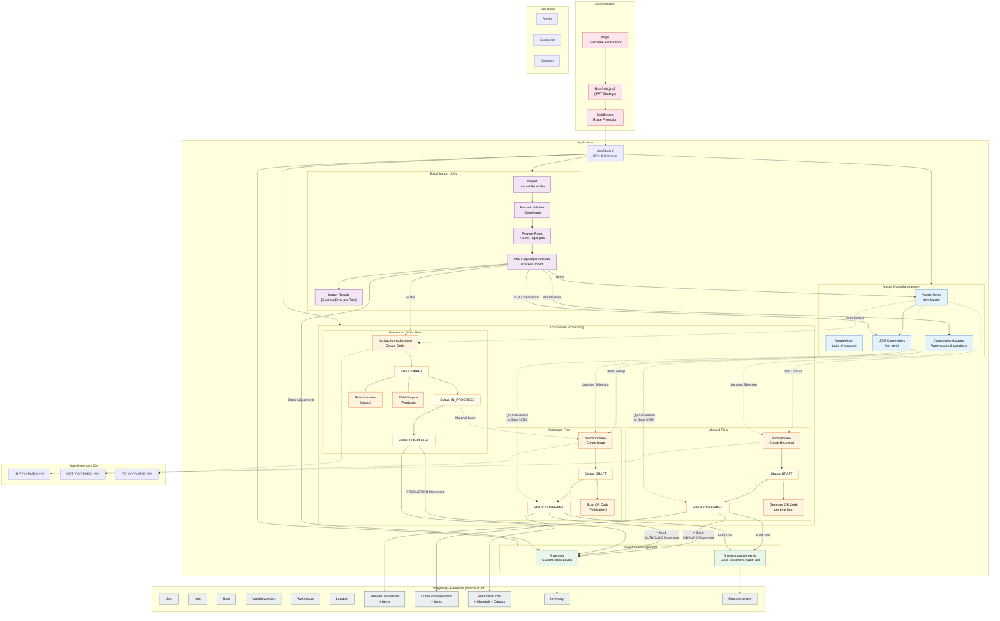

# Sutandi MES - System Flow Diagram

## Flow Summary

### 1. Authentication Flow
- User logs in via `/login` with username and password
- NextAuth.js validates credentials against the database (bcrypt)
- JWT token issued with user ID, name, and role (ADMIN / SUPERVISOR / OPERATOR)
- Middleware protects all routes except `/login` and `/api/auth`

### 2. Master Data (Foundation)
- **Items**: Define raw materials, WIP, finished goods, packaging, consumables
- **UOM**: Define units of measure (kg, pcs, litre, etc.)
- **UOM Conversions**: Per-item conversion factors between units
- **Warehouses & Locations**: Physical storage zones

### 3. Inbound (Receiving)
1. Create inbound transaction with supplier info and line items
2. Auto-generates transaction number (`IN-YYYYMMDD-###`)
3. Each line item gets a QR code with encoded payload (item, batch, qty, UOM)
4. On confirmation: stock is **added** to inventory, stock movements are recorded

### 4. Outbound (Issuing)
1. Create outbound transaction with purpose and line items
2. Auto-generates transaction number (`OUT-YYYYMMDD-###`)
3. Can optionally link to a production order (material consumption)
4. QR scanning for verification
5. On confirmation: stock is **deducted** from inventory, stock movements are recorded

### 5. Production Orders
1. Define BOM (Bill of Materials) with input materials and output products
2. Auto-generates order number (`PO-YYYYMMDD-###`)
3. Flow: DRAFT -> IN_PROGRESS -> COMPLETED
4. Materials consumed via linked outbound transactions
5. Outputs recorded as production stock movements

### 6. Inventory
- **Stock Levels**: Real-time view of quantity per item + location + batch + UOM
- **Stock Movements**: Full audit trail of all changes (INBOUND, OUTBOUND, ADJUSTMENT, TRANSFER, PRODUCTION)

### 7. Excel Import
- Bulk import for: items, warehouses, UOM conversions, inventory adjustments, BOMs
- Flow: Upload -> Parse -> Preview/Validate -> Execute -> Results
- Templates available for download with instructions
