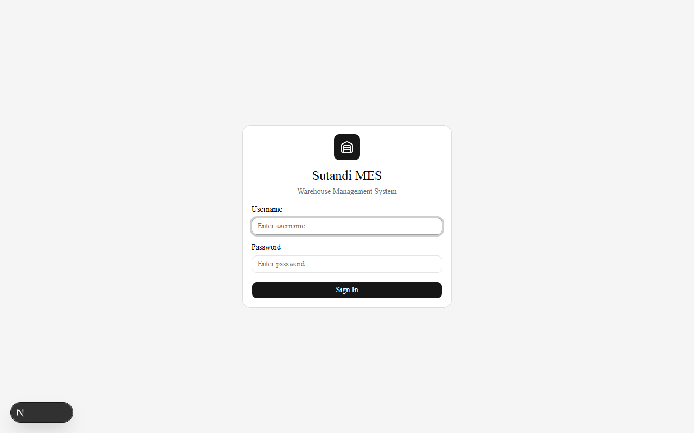
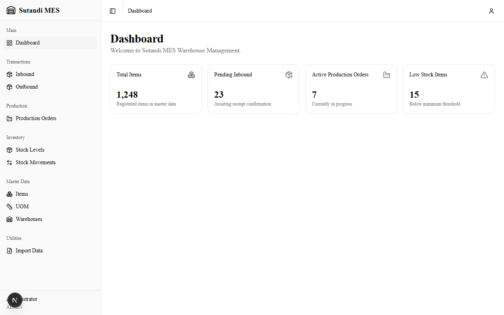
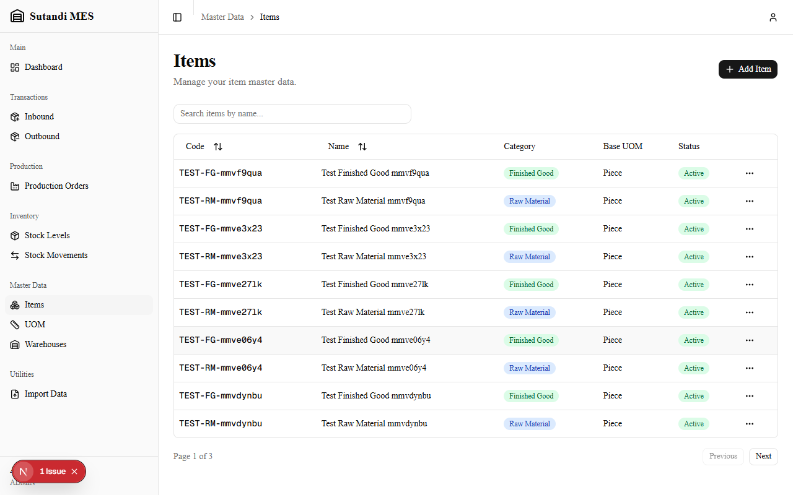
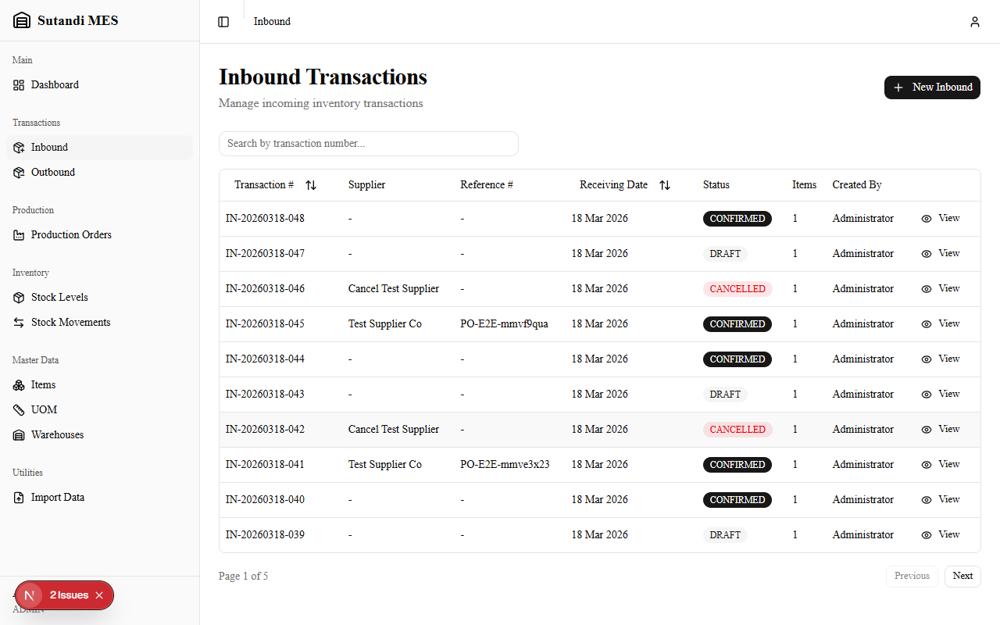
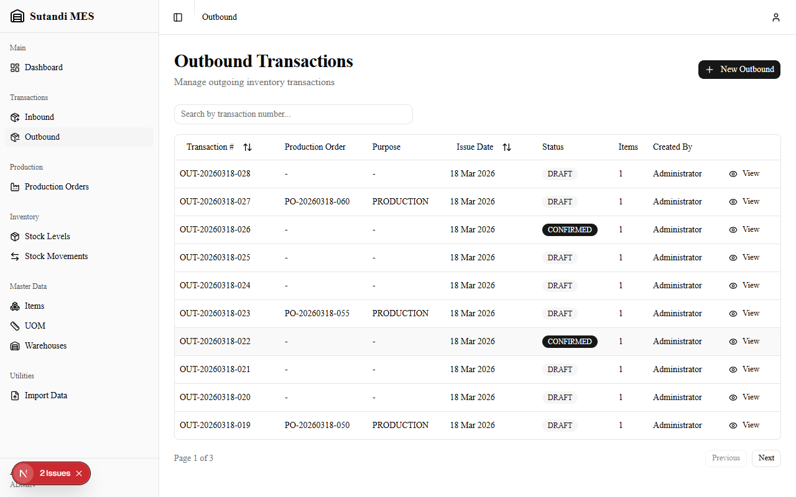
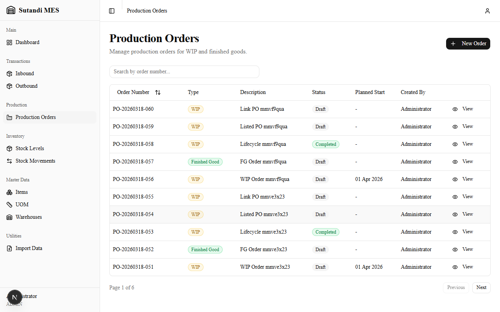
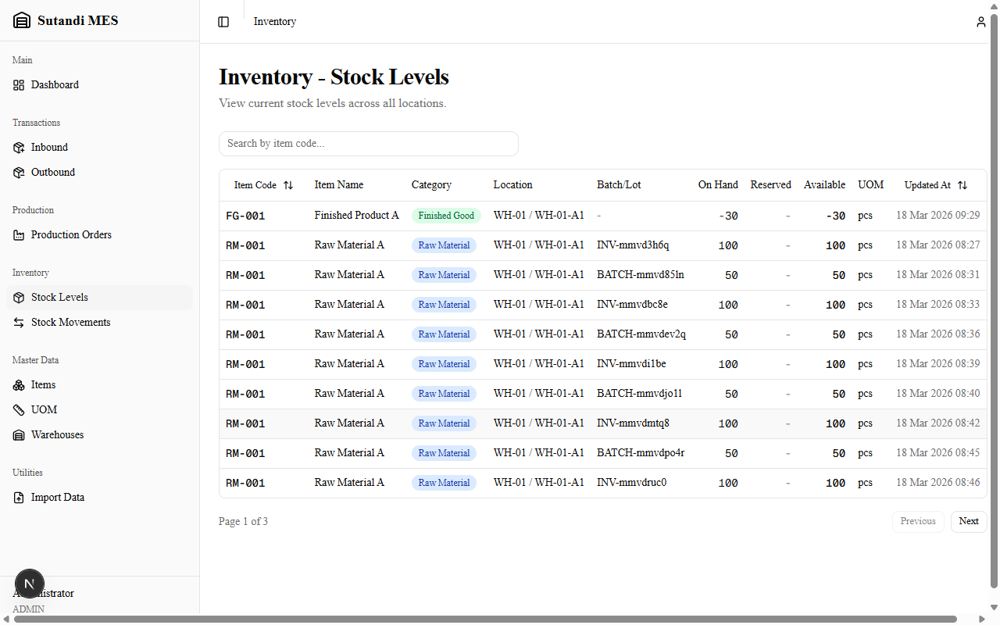
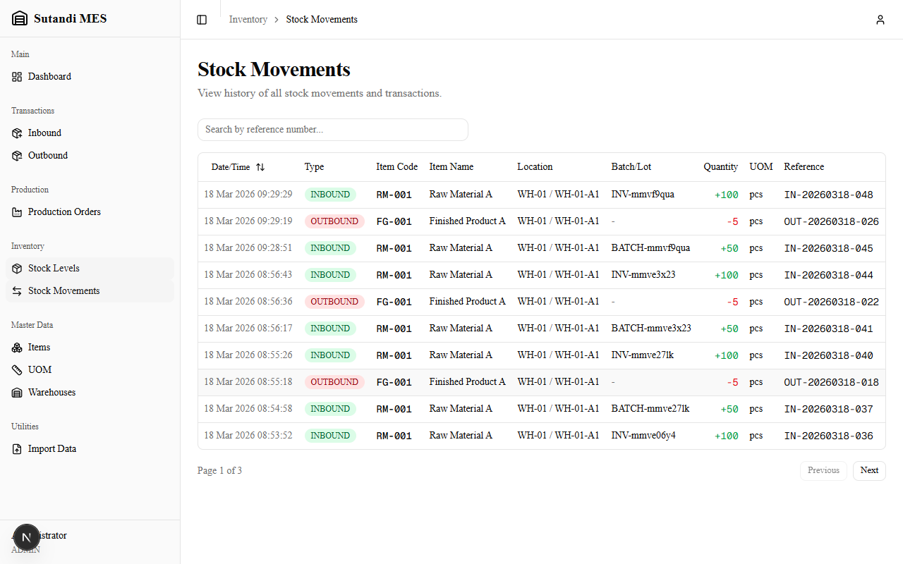
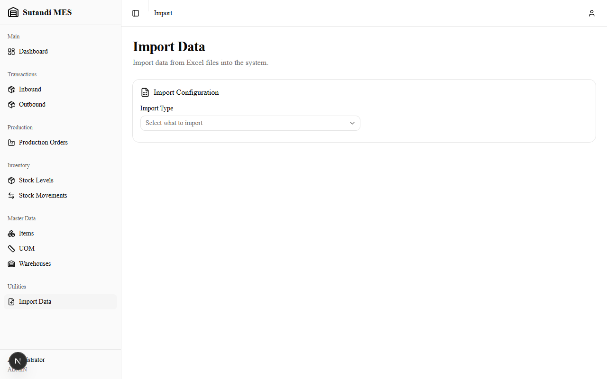

# Sutandi MES - Flow Process Document

## 1. Login

Users access the system by entering their **username** and **password**. The system supports three roles: **Admin**, **Supervisor**, and **Operator**.



After successful login, users are redirected to the **Dashboard**.

---

## 2. Dashboard

The dashboard provides a quick overview of the system with key metrics:

- **Total Items** - Number of registered items in master data
- **Pending Inbound** - Transactions awaiting receipt confirmation
- **Active Production Orders** - Orders currently in progress
- **Low Stock Items** - Items below minimum threshold

The sidebar on the left provides navigation to all modules.



---

## 3. Master Data Setup

Before processing any transactions, master data must be configured. This is the foundation of the system.

### 3.1 Items

Manage the item catalog. Each item has a **code**, **name**, **category** (Raw Material, Finished Good, WIP, Packaging, Consumable), and a **base unit of measure (UOM)**.



### 3.2 UOM (Units of Measure)

Define units such as Piece (pcs), Pack, Bundle, Kilogram (kg), etc. UOM conversions can be configured per item (e.g., 1 pack = 12 pcs).

### 3.3 Warehouses & Locations

Define physical warehouses and their storage locations (zones/bins). Each inventory movement is tracked at the location level.

---

## 4. Inbound Transactions (Receiving)

Inbound transactions record goods **received** into the warehouse.

### Process Flow:

1. Click **"+ New Inbound"** to create a new receiving transaction
2. Enter supplier information, reference number, and receiving date
3. Add line items: select item, quantity, UOM, storage location, and batch/lot number
4. Save as **DRAFT**
5. Review and click **Confirm** to finalize
6. On confirmation, stock is **added** to inventory and a stock movement record is created
7. Print **Bin Labels** from the Inventory page for physical goods (one QR per item + location + batch + UOM)

### Status Flow:
- **DRAFT** - Transaction created, can be edited
- **CONFIRMED** - Finalized, stock updated (cannot be edited)
- **CANCELLED** - Voided transaction



---

## 5. Outbound Transactions (Issuing)

Outbound transactions record goods **issued** from the warehouse.

### Process Flow:

1. Click **"+ New Outbound"** to create a new issue transaction
2. Optionally link to a **Production Order** (for material consumption)
3. Enter purpose, issue date, and line items
4. **Scan the bin QR** to auto-fill item, location, batch, and UOM — or select manually
5. Enter the quantity to take (can be partial; the same label remains valid on the remaining stock)
6. Save as **DRAFT**, then **Confirm** to finalize
7. On confirmation, stock is **deducted** from inventory and a stock movement record is created

### Status Flow:
- Same as Inbound: **DRAFT** -> **CONFIRMED** or **CANCELLED**



---

## 6. Production Orders

Production orders define the **Bill of Materials (BOM)** -- what materials go in and what products come out.

### Process Flow:

1. Click **"+ New Order"** to create a production order
2. Select order type: **WIP** (Work in Progress) or **Finished Good**
3. Define **Materials** (inputs) with required quantities
4. Define **Outputs** (products) with target quantities
5. Set planned start/end dates
6. Status progression: **DRAFT** -> **IN_PROGRESS** -> **COMPLETED**
7. Materials are consumed via linked **Outbound Transactions**
8. Outputs are recorded upon completion



---

## 7. Inventory

### 7.1 Stock Levels

View real-time stock quantities across all locations. The table shows:

- **Item Code & Name**
- **Category** (Raw Material, Finished Good, etc.)
- **Location** (Warehouse / Zone)
- **Batch/Lot** number
- **On Hand** quantity
- **Reserved** quantity (allocated to production — click to see which orders hold it)
- **Available** quantity (On Hand - Reserved)
- **Label** — print a QR bin label. Encodes item + location + batch + UOM so the same sticker stays valid across partial picks



### 7.2 Stock Movements

A complete **audit trail** of all inventory changes. Every stock change is recorded with:

- **Date/Time** of movement
- **Type**: INBOUND, OUTBOUND, ADJUSTMENT, TRANSFER, or PRODUCTION
- **Item** affected
- **Location** involved
- **Quantity** changed (+ for additions, - for deductions)
- **Reference** transaction number for traceability



---

## 8. Import Data (Excel)

Bulk import data into the system using Excel files. Supports importing:

- **Items** - Item master data
- **Warehouses** - Warehouses and storage locations
- **UOM Conversions** - Unit conversion factors
- **Inventory** - Stock level adjustments
- **BOM** - Bill of Materials (creates Production Orders)

### Process Flow:

1. Select the **Import Type**
2. Download the **Excel template** (includes instructions)
3. Fill in the template with your data
4. Upload the completed file
5. **Preview** the data and review any validation errors
6. Click **Import** to process
7. Review the results summary (success/error count per row)



---

## Overall System Flow Summary

```
Master Data Setup          Transactions              Inventory
==================    ======================    ==================
                      
  Items ──────────>   Inbound (Receiving)  ──>   + Stock Added
  UOM   ──────────>     └── Confirm              │
  Warehouses ─────>                               │
                                                  ├── Stock Levels
                      Outbound (Issuing)   ──>   │  (Real-time)
                        ├── Scan Bin QR          │    └── Print Bin Label
                        ├── (partial ok)         │
                        └── Confirm         ──>  - Stock Deducted
                                                  │
                      Production Orders           ├── Stock Movements
                        ├── Define BOM            │  (Audit Trail)
                        ├── Materials ─────────>  │
                        └── Outputs ───────────>  │
                                                  
  Excel Import ──────────────────────────────>   Bulk Data Load
```

---

## User Roles

| Role | Description |
|------|-------------|
| **Admin** | Full access to all modules including master data and user management |
| **Supervisor** | Can create and confirm transactions, view all reports |
| **Operator** | Can create draft transactions, limited access |
