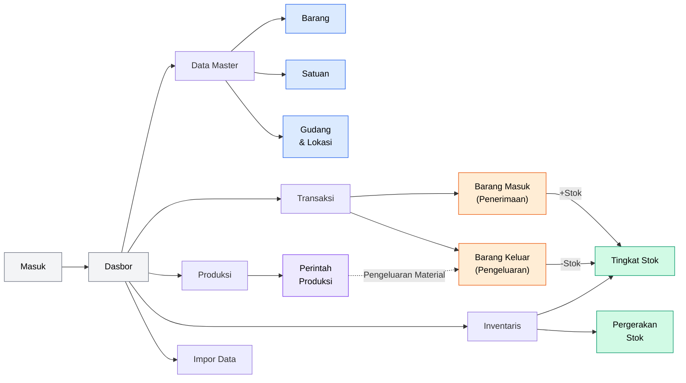
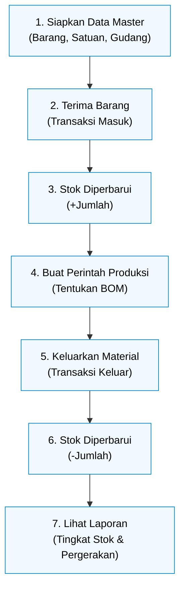
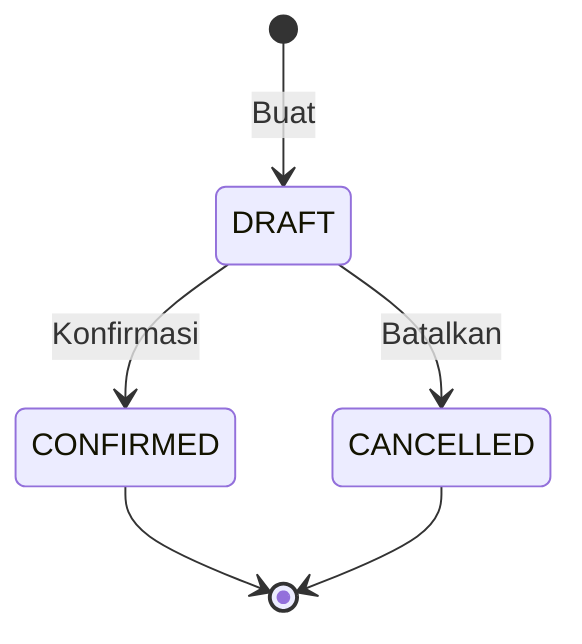
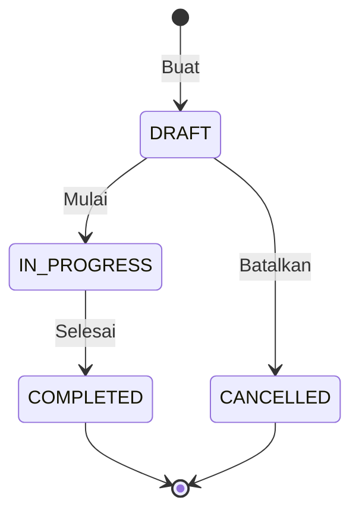

# Sutandi MES - Gambaran Umum Sistem

```mermaid
flowchart LR
    LOGIN["Masuk"] --> DASHBOARD["Dasbor"]

    DASHBOARD --> MASTER["Data Master"]
    DASHBOARD --> TXN["Transaksi"]
    DASHBOARD --> PROD["Produksi"]
    DASHBOARD --> INV["Inventaris"]
    DASHBOARD --> IMPORT["Impor Data"]

    MASTER --> ITEMS["Barang"]
    MASTER --> UOM_M["Satuan"]
    MASTER --> WH["Gudang\n& Lokasi"]

    TXN --> INBOUND["Barang Masuk\n(Penerimaan)"]
    TXN --> OUTBOUND["Barang Keluar\n(Pengeluaran)"]

    PROD --> PO["Perintah\nProduksi"]

    INV --> STOCK["Tingkat Stok"]
    INV --> MOVES["Pergerakan\nStok"]

    INBOUND -->|"+Stok"| STOCK
    OUTBOUND -->|"-Stok"| STOCK
    PO -.->|"Pengeluaran Material"| OUTBOUND

    classDef blue fill:#dbeafe,stroke:#2563eb,color:#000
    classDef green fill:#d1fae5,stroke:#059669,color:#000
    classDef orange fill:#ffedd5,stroke:#ea580c,color:#000
    classDef purple fill:#ede9fe,stroke:#7c3aed,color:#000
    classDef gray fill:#f3f4f6,stroke:#6b7280,color:#000

    class LOGIN,DASHBOARD gray
    class ITEMS,UOM_M,WH blue
    class INBOUND,OUTBOUND orange
    class PO purple
    class STOCK,MOVES green
```

## Cara Kerja (Sederhana)

```mermaid
flowchart TD
    A["1. Siapkan Data Master\n(Barang, Satuan, Gudang)"] --> B["2. Terima Barang\n(Transaksi Masuk)"]
    B --> C["3. Stok Diperbarui\n(+Jumlah)"]
    C --> D["4. Buat Perintah Produksi\n(Tentukan BOM)"]
    D --> E["5. Keluarkan Material\n(Transaksi Keluar)"]
    E --> F["6. Stok Diperbarui\n(-Jumlah)"]
    F --> G["7. Lihat Laporan\n(Tingkat Stok & Pergerakan)"]

    classDef step fill:#f0f9ff,stroke:#0284c7,color:#000
    class A,B,C,D,E,F,G step
```

## Alur Status Transaksi

```mermaid
stateDiagram-v2
    [*] --> DRAFT : Buat
    DRAFT --> CONFIRMED : Konfirmasi
    DRAFT --> CANCELLED : Batalkan
    CONFIRMED --> [*]
    CANCELLED --> [*]
```

## Alur Status Perintah Produksi

```mermaid
stateDiagram-v2
    [*] --> DRAFT : Buat
    DRAFT --> IN_PROGRESS : Mulai
    DRAFT --> CANCELLED : Batalkan
    IN_PROGRESS --> COMPLETED : Selesai
    COMPLETED --> [*]
    CANCELLED --> [*]
```
