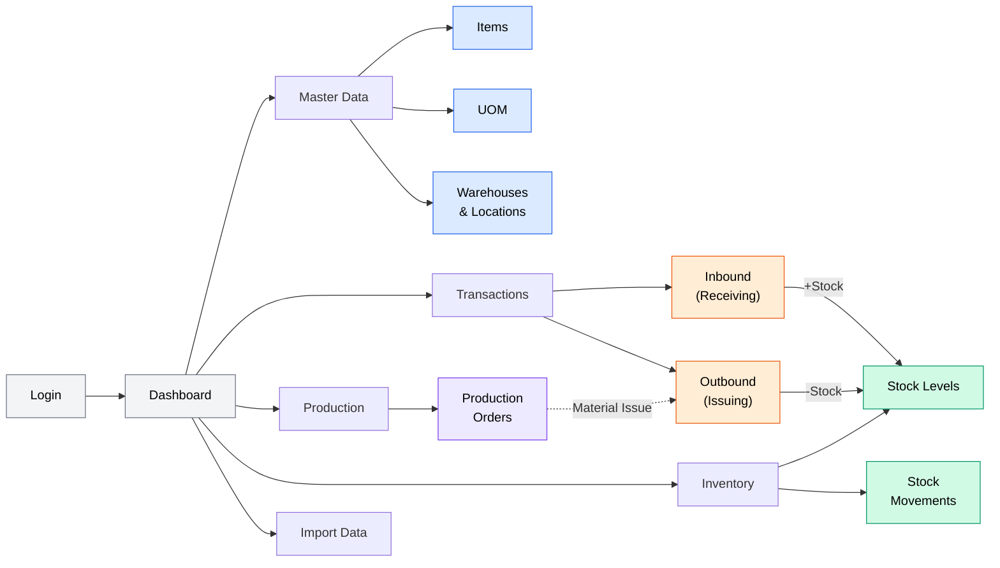
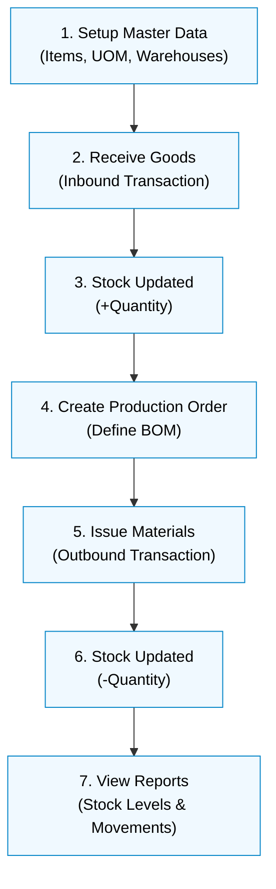
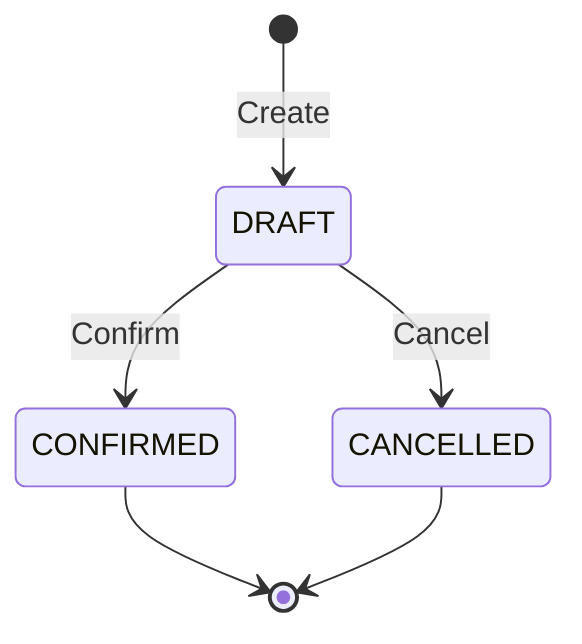
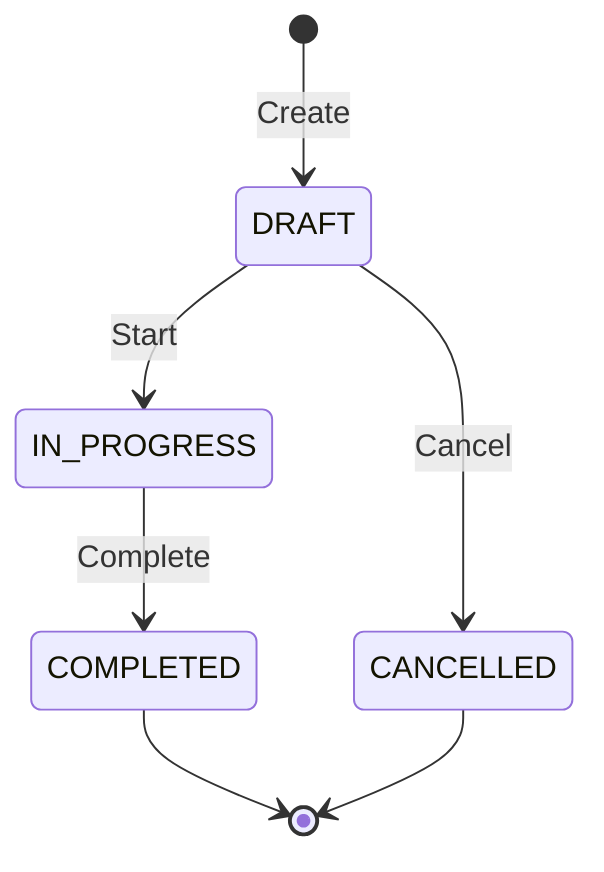

# Sutandi MES - System Overview

```mermaid
flowchart LR
    LOGIN["Login"] --> DASHBOARD["Dashboard"]

    DASHBOARD --> MASTER["Master Data"]
    DASHBOARD --> TXN["Transactions"]
    DASHBOARD --> PROD["Production"]
    DASHBOARD --> INV["Inventory"]
    DASHBOARD --> IMPORT["Import Data"]

    MASTER --> ITEMS["Items"]
    MASTER --> UOM_M["UOM"]
    MASTER --> WH["Warehouses\n& Locations"]

    TXN --> INBOUND["Inbound\n(Receiving)"]
    TXN --> OUTBOUND["Outbound\n(Issuing)"]

    PROD --> PO["Production\nOrders"]

    INV --> STOCK["Stock Levels"]
    INV --> MOVES["Stock\nMovements"]

    INBOUND -->|"+Stock"| STOCK
    OUTBOUND -->|"-Stock"| STOCK
    PO -.->|"Material Issue"| OUTBOUND

    classDef blue fill:#dbeafe,stroke:#2563eb,color:#000
    classDef green fill:#d1fae5,stroke:#059669,color:#000
    classDef orange fill:#ffedd5,stroke:#ea580c,color:#000
    classDef purple fill:#ede9fe,stroke:#7c3aed,color:#000
    classDef gray fill:#f3f4f6,stroke:#6b7280,color:#000

    class LOGIN,DASHBOARD gray
    class ITEMS,UOM_M,WH blue
    class INBOUND,OUTBOUND orange
    class PO purple
    class STOCK,MOVES green
```

## How It Works (Simple)

```mermaid
flowchart TD
    A["1. Setup Master Data\n(Items, UOM, Warehouses)"] --> B["2. Receive Goods\n(Inbound Transaction)"]
    B --> C["3. Stock Updated\n(+Quantity)"]
    C --> D["4. Create Production Order\n(Define BOM)"]
    D --> E["5. Issue Materials\n(Outbound Transaction)"]
    E --> F["6. Stock Updated\n(-Quantity)"]
    F --> G["7. View Reports\n(Stock Levels & Movements)"]

    classDef step fill:#f0f9ff,stroke:#0284c7,color:#000
    class A,B,C,D,E,F,G step
```

## Transaction Status Flow

```mermaid
stateDiagram-v2
    [*] --> DRAFT : Create
    DRAFT --> CONFIRMED : Confirm
    DRAFT --> CANCELLED : Cancel
    CONFIRMED --> [*]
    CANCELLED --> [*]
```

## Production Order Status Flow

```mermaid
stateDiagram-v2
    [*] --> DRAFT : Create
    DRAFT --> IN_PROGRESS : Start
    DRAFT --> CANCELLED : Cancel
    IN_PROGRESS --> COMPLETED : Complete
    COMPLETED --> [*]
    CANCELLED --> [*]
```
