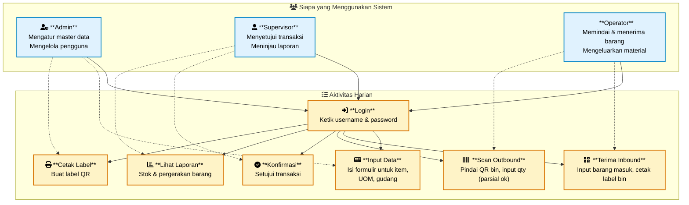
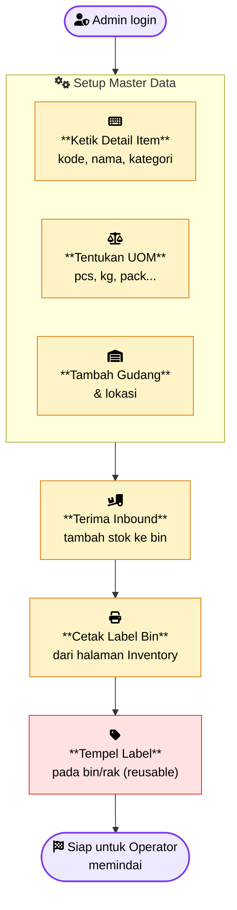
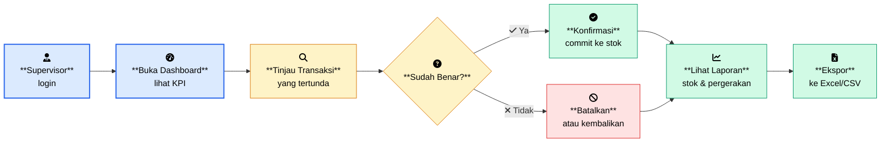
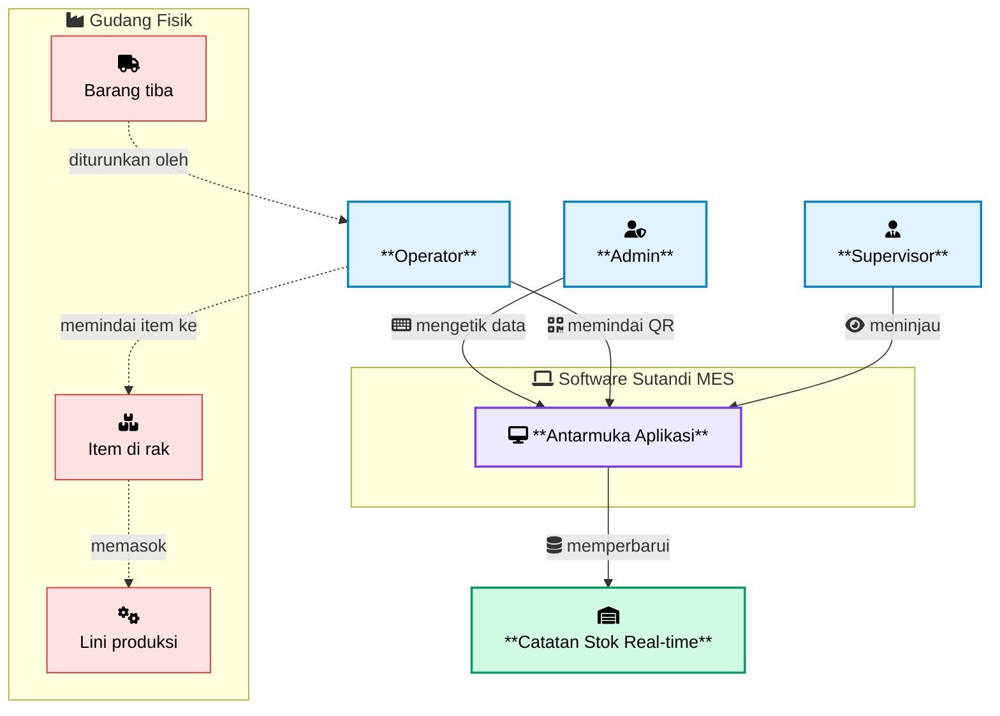

# Sutandi MES - Diagram Aktivitas Pengguna

Diagram ini menggambarkan aktivitas harian yang dilakukan pengguna di dalam sistem, lengkap dengan ikon yang mewakili setiap tindakan (memindai, menginput, melihat, dll).

> **Catatan:** Mermaid menampilkan ikon FontAwesome melalui awalan `fa:`. Buka file ini di penampil Mermaid yang memiliki akses internet (GitHub, VS Code Mermaid Preview, mermaid.live) agar ikon dapat ditampilkan.

---

## 1. Gambaran Umum Aktivitas Pengguna

---

## 2. Alur Harian Operator (Workflow Pemindaian)

```mermaid
flowchart LR
    A["fa:fa-mobile-alt<br/>**Buka Aplikasi**<br/>di tablet/HP"] --> B["fa:fa-sign-in-alt<br/>**Login**<br/>masukkan kredensial"]
    B --> C["fa:fa-truck-loading<br/>**Barang Tiba**<br/>di gudang"]
    C --> D["fa:fa-keyboard<br/>**Input Penerimaan**<br/>item, qty, lokasi, batch"]
    D --> E["fa:fa-print<br/>**Cetak Label Bin**<br/>tempel di rak/bin"]
    E --> F["fa:fa-check<br/>**Konfirmasi Inbound**<br/>stok BERTAMBAH"]

    F --> G["fa:fa-clipboard-list<br/>**Pilih Production Order**<br/>dari daftar"]
    G --> H["fa:fa-qrcode<br/>**Pindai QR Bin**<br/>auto-isi item/lokasi/batch, input qty"]
    H --> I["fa:fa-minus-circle<br/>**Keluarkan Material**<br/>stok BERKURANG"]
    I --> J["fa:fa-check-double<br/>**Tandai Selesai**"]

    classDef start fill:#dbeafe,stroke:#2563eb,color:#000
    classDef scan fill:#fed7aa,stroke:#ea580c,color:#000,stroke-width:2px
    classDef input fill:#fef9c3,stroke:#ca8a04,color:#000
    classDef done fill:#d1fae5,stroke:#059669,color:#000

    class A,B,C start
    class H scan
    class D,G input
    class E,F,I,J done
```

---

## 3. Aktivitas Setup Admin (Input Data)

---

## 4. Aktivitas Tinjauan Supervisor

---

## 5. Gambaran Besar - Semua Pengguna Bersama

---

## Keterangan

| Ikon | Aktivitas |
|------|-----------|
| fa:fa-keyboard | Mengetik / menginput data ke formulir |
| fa:fa-qrcode / fa:fa-barcode | Memindai QR atau barcode dengan kamera |
| fa:fa-check-circle | Mengonfirmasi / menyetujui transaksi |
| fa:fa-chart-bar | Melihat laporan & dashboard |
| fa:fa-print | Mencetak label QR |
| fa:fa-user-shield | Peran Admin |
| fa:fa-user-tie | Peran Supervisor |
| fa:fa-user-hard-hat | Peran Operator (lantai gudang) |
