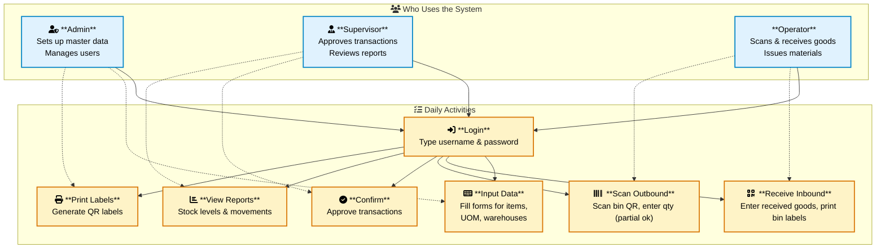
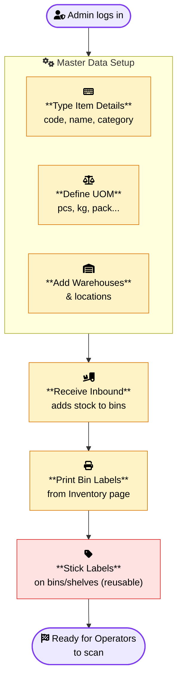
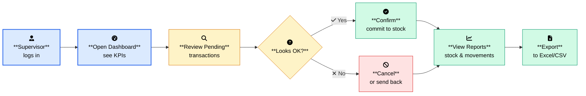
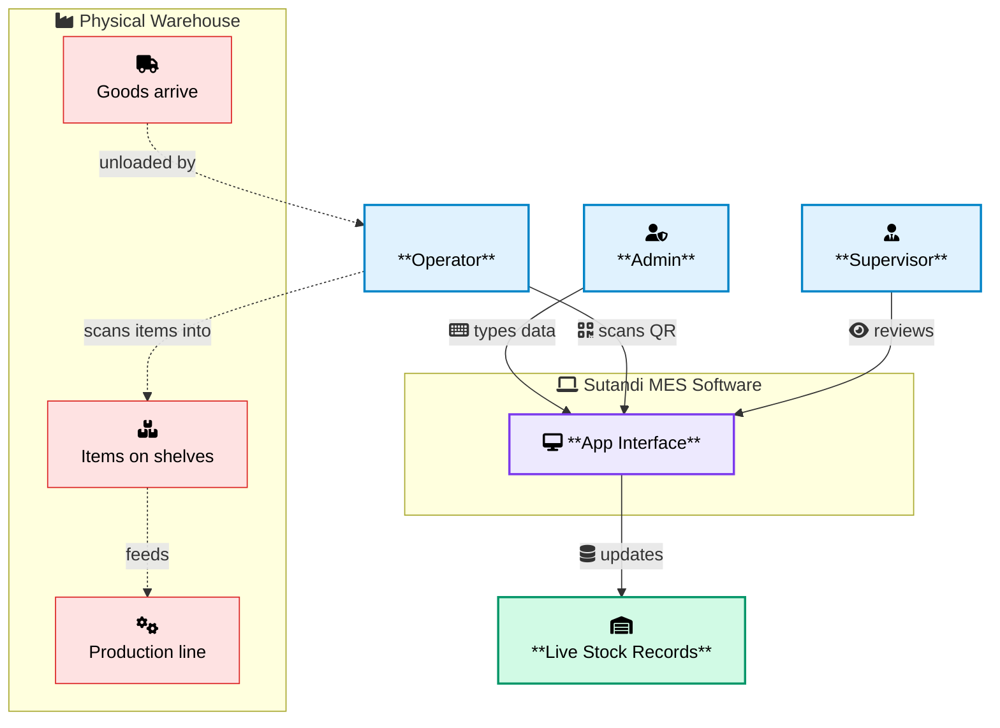

# Sutandi MES - User Activities Diagram

This diagram illustrates the day-to-day activities users perform in the system, with icons representing each action (scanning, inputting, viewing, etc.).

> **Note:** Mermaid renders FontAwesome icons via the `fa:` prefix. View this file in a Mermaid renderer with internet access (GitHub, VS Code Mermaid Preview, mermaid.live) for the icons to display.

---

## 1. User Activities Overview

---

## 2. Operator's Daily Journey (Scanning Workflow)

```mermaid
flowchart LR
    A["fa:fa-mobile-alt<br/>**Open App**<br/>on tablet/phone"] --> B["fa:fa-sign-in-alt<br/>**Login**<br/>enter credentials"]
    B --> C["fa:fa-truck-loading<br/>**Goods Arrive**<br/>at warehouse"]
    C --> D["fa:fa-keyboard<br/>**Enter Received**<br/>item, qty, location, batch"]
    D --> E["fa:fa-print<br/>**Print Bin Label**<br/>stick on shelf/bin"]
    E --> F["fa:fa-check<br/>**Confirm Inbound**<br/>stock goes UP"]

    F --> G["fa:fa-clipboard-list<br/>**Pick Production Order**<br/>from list"]
    G --> H["fa:fa-qrcode<br/>**Scan Bin QR**<br/>auto-fill item/loc/batch, enter qty"]
    H --> I["fa:fa-minus-circle<br/>**Issue Material**<br/>stock goes DOWN"]
    I --> J["fa:fa-check-double<br/>**Mark Complete**"]

    classDef start fill:#dbeafe,stroke:#2563eb,color:#000
    classDef scan fill:#fed7aa,stroke:#ea580c,color:#000,stroke-width:2px
    classDef input fill:#fef9c3,stroke:#ca8a04,color:#000
    classDef done fill:#d1fae5,stroke:#059669,color:#000

    class A,B,C start
    class H scan
    class D,G input
    class E,F,I,J done
```

---

## 3. Admin's Setup Activities (Data Entry)

---

## 4. Supervisor's Review Activities

---

## 5. The Big Picture - All Users Together

---

## Legend

| Icon | Activity |
|------|----------|
| fa:fa-keyboard | Typing / inputting data into forms |
| fa:fa-qrcode / fa:fa-barcode | Scanning QR or barcode with camera |
| fa:fa-check-circle | Confirming / approving a transaction |
| fa:fa-chart-bar | Viewing reports & dashboards |
| fa:fa-print | Printing QR labels |
| fa:fa-user-shield | Admin role |
| fa:fa-user-tie | Supervisor role |
| fa:fa-user-hard-hat | Operator role (warehouse floor) |
